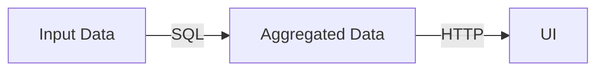

## Motivation

In your UI, there are going to be charts that are informed by data in the warehouse. In order to make the UI responsive and save the user's browser from having to download too much data, you will want to pre-aggregate the data for those charts in the warehouse. This issue is an example of that pattern.

There are a couple of approaches that you can take in your project:
1. Use a scheduled SQL query to populate the table on a regular basis, and then save the output from that table to a CSV or JSON file in Cloud Storage, then from the UI request the file from Cloud Storage, or...
2. Use a Cloud Function to run a SQL query and return some CSV or JSON data, then from the UI request the data from the Cloud Function directly; this Cloud Function would essentially act as a simple API.

There are pros and cons to each approach. The first approach is simpler to implement requires fewer queries to the warehouse (and thus can be cheaper and provide faster responses to the UI), but involves an extra step of saving the data to a file in Cloud Storage. The second approach requires more queries to the warehouse (and thus can be more expensive and provide slower responses to the UI), but does not require an extra step of saving the data to a file in Cloud Storage (and also allows more flexibility in terms of being able to accept parameters to the query).

- This issue, along with issue #4, is an example of the first approach.

> **A note about organizing your code...**
>
> The Cloud Functions and Workflows for the projects should be stored in subfolders of the `tasks/` folder of your project repository. I recommend referring to the [Week 8](https://github.com/Weitzman-MUSA-GeoCloud/course-info/tree/main/week08) video and resources for guidance on how to write, organize, test, and deploy Cloud Functions, and [Week 9](https://github.com/Weitzman-MUSA-GeoCloud/course-info/tree/main/week09) video and resources for guidance on how to run SQL from within Cloud Functions.

## Implementation

Dynamically populate (i.e. `CREATE OR REPLACE`) a table named `derived.tax_year_assessment_bins`. Imagine that the data in this table informs a distribution of the assessed values. The values should be divided into bins of some consistent widths either on a linear or logarithmic scale, and the number of properties with assessed values in each bin should be counted up. For example, it could look something like this:

The table should have the following columns:
* `tax_year` -- The year for which the tax assessment value applies
* `lower_bound` -- The minimum assessed value cutoff in the histogram bin
* `upper_bound` -- The maximum assessed value cutoff in the histogram bin
* `property_count` -- The number of properties that fall between that min and max value

Use the `core.opa_assessments` table to build this  table.

**Acceptance criteria:**
- [ ] A Cloud Function to run the `CREATE TABLE` SQL to generate the `derived.tax_year_assessment_bins` table. The actual SQL statement should be in its own _.sql_ file (e.g. `create_derived_tax_year_assessment_bins.sql`). See the `run_sql` task from the course_info as an example (https://github.com/Weitzman-MUSA-GeoCloud/course-info/tree/main/week08/explore_phila_data/run_sql)