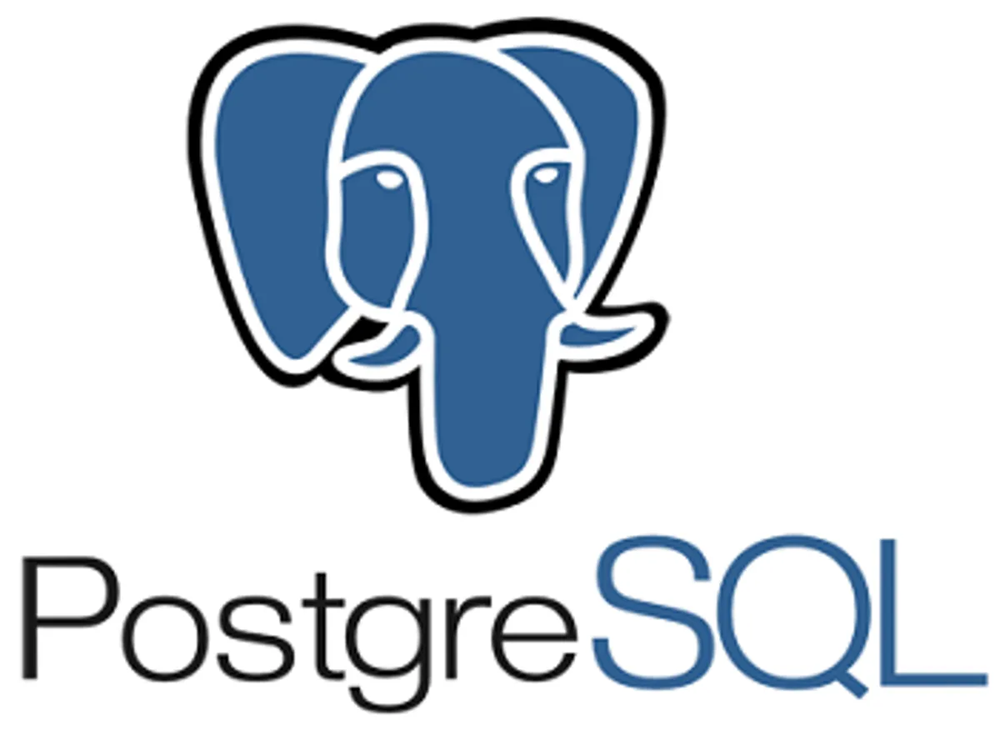
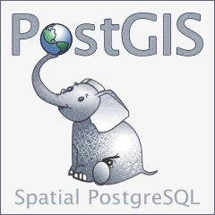
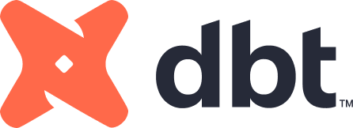
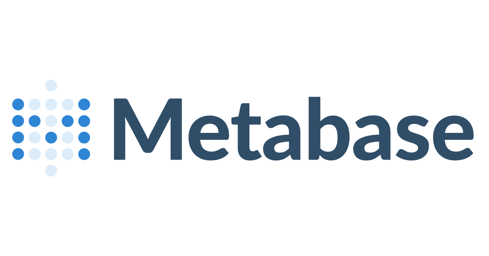
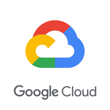

# Welcome to MUSA509: Geospatial Cloud Computing & Visualization

---

## Agenda

1.  Course content overview
    - Goals
    - Content overview
1.  Logistics
1.  Interactive: Set up tools
    - PostgreSQL & PG Admin
    - VS Code (with useful extensions)
    - A Terminal
    - GitHub

---

## Goals of this _track_ (MUSA 6110 & 5090)

Give you the skills to build **data-centric cloud-based applications and reports**, powered by data pipelines that take raw data (spatial and otherwise) from around the web, **to provide answers to operational questions**.

By the end of _this_ course, you'll have built your own data-centric operational tool in the cloud.

---

## Data-centric Cloud-based Tools?

- Let's talk about it.
  https://docs.google.com/presentation/d/1JX-y6-s0PUilrR6_NlFmqc7w_2F_OaznORmtu-TTlpI/edit?usp=sharing

---

# Overview of Skills & Technologies

---

## Spatial Databases




Databases are a super power once you learn a bit about them. We’ll learn lots of **SQL**, a very transferable skill

How we’ll use them:
- Querying data efficiently
- Managing datasets with explicit relationships between them
- Query geography (e.g., give me all bike share stations within 500 meters of a cafe), etc.

---

## Large, messy datasets




We will work with large and/or messy datasets such as OpenStreetMap (global), US Census (national), Philadelphia Office of Property Assessment (local), Placer.ai (proprietary) and more, in a variety of formats.

We’ll cover:
- Techniques for taming these datasets
- Using tools to access, store, transform, and run analyses on datasets
- Best practices for modeling and organizing data

---

## Data Visualization Platforms





We'll get introduced to some common platforms for visualizing data stored in cloud repositories. These can be good for lightweight exploration of data, or quick prototyping of dashboards.

---

## Enough scripting to be dangerous


**Python** and **JavaScript** are powerful programming languages with a huge communities, which means that there are a lot of amazing packages.

We need these scripting languages to:
- Fetch and process data from around the web
- Build APIs to serve up processed data
- Provide glue between a user interaction on a webpage and a database transaction

---

## API basics and HTTP requests

An Application Programming Interface (**API**) gives an interface for computers to communicate with one another. We will learn patterns that will help us extract dynamic data from a number of sources through APIs, and to create our own APIs.

Where possible, examples will be given in the approximately equivalent Python and JavaScript.

<div class="columns-2">
<div>


```py
from flask import Flask
app = Flask(__name__)

@app.route('/', methods=['GET'])
def hello_world():
    return 'Hello, World!'
```
</div>

<div>


```js
import express from 'express';
const app = express();
  
app.get('/', (req, res) => {
    res.send('Hello, World!');
});
```
</div>

---

## Cloud Services




Our final work will all be in the cloud!

- Data will be stored in Google Cloud Storage
- Pipelines and servers will be run in Google Cloud Functions
- We’ll use Google Cloud for accessing data in BigQuery

Though we'll work in Google Cloud for this class, I'll mention analagous services in Amazon Web Services (AWS), Microsoft Azure, etc. when applicable.

---

# Logistics

---

## Living Course Info

https://github.com/musa-5090-spring-2024/course-info

Contains the syllabus, schedule, assignments, etc.

---

## Class format

- The majority of lectures will be asynchronous.
- The beginning of each class will be devoted to answering questions, clarifying content, or discussions.
- The later part of classes will be interactive, sometimes with some deliverable expected by the end that will make up part of the participation portion of your grade.

<!--
  - **The majority of lectures will be async**

    That means that, when we have a lecture, I'll record the lecture content and make it available to you to watch _before_ the class session. You'll be expected to watch the videos before class.

  - **The beginning of each class will be devoted to answering questions, or clarifying content, or discussions.**

    As you're going through the video, you'll want to be actively following along. If you have questions or something is unclear, please feel free to leave a comment on the actual video. These videos will be unlisted, so it's not like someone searching YouTube will be able to see your comment. However you will have to have a google account in order to actually leave a comment.

    In class I'll go through the comments and expound on anything from the video that people bring up.

    Some of the material will merit discussion -- when I anticipate this I'll try to call it out in the video.
  
  - **The later part of classes will be interactive...**
-->
---

## Books

There will occasionally be readings from the following books to provide more depth on certain core topics. Both are available from [O'Reilly for Higher Education](http://pwp.library.upenn.edu.proxy.library.upenn.edu/loggedin/pwp/pw-oreilly.html):
  - _Data Pipelines Pocket Reference_ by James Densmore
  - _Designing Data-Intensive Applications_ by Martin Kleppmann

---

# Questions?

---

## Let's get configured!

- **VS Code** (or your editor of choice) and extensions
  - sqlfluff
  - eslint (for JavaScript)
  - flake8 (for Python)
- A command line terminal (you can use the one embedded in VS Code)
- A **git** client (e.g. **GitHub Desktop**, or the VS Code git tools, _but also ensure that you can run `git` on the command line_, just in case you need it)
- **PostgreSQL** and a client such as **PGAdmin** ([sneak peek at next week's slides](https://docs.google.com/presentation/d/1v-nMrK1-xhoOSA4Euq3B5xq6pSm0uv-D_485J4d_yZo/edit#slide=id.g1d409c96e66_0_0))
  - [PostgreSQL setup instructions](ex_postgres.md)
